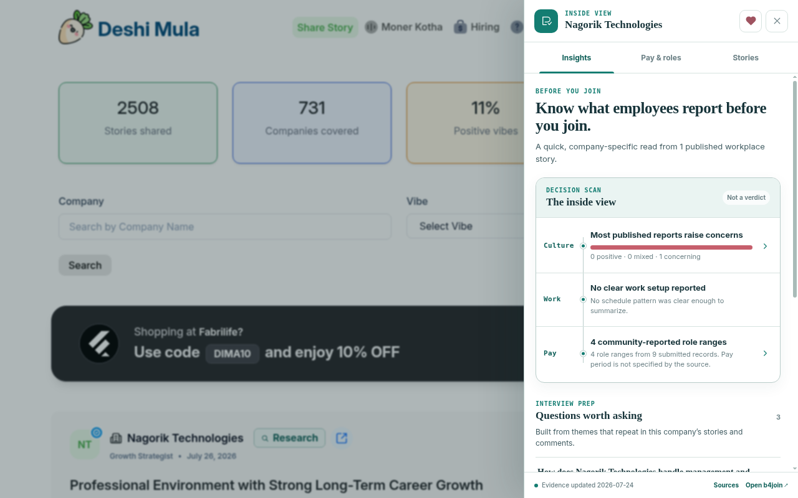

# Deshi Mula Extended

A Chrome extension that turns [Deshi Mula](https://deshimula.com/) company pages into a focused research workspace with company identities, workplace signals, reported salaries, jobs, stories, and cited answers.

<p>
  <a href="https://github.com/montasim/deshi-mula-extended/actions/workflows/release.yml"></a>
  <a href="https://github.com/montasim/deshi-mula-extended/releases/latest"></a>
  
  
  <a href="https://www.supportkori.com/montasim"></a>
</p>



## Features

- Reveals confirmed company identities behind stylized names on Deshi Mula.
- Adds a research panel beside the site instead of sending users to a separate workflow.
- Surfaces culture signals, community workplace stories, salary evidence, roles, and job links.
- Searches company stories and answers questions against available evidence with citations.
- Keeps the extension thin: company research and generated answers come from the b4join API.
- Runs only on `deshimula.com` and requests only the permissions required for its single purpose.

Salary and workplace information may be community-submitted. Treat it as research input and verify material claims independently before making employment decisions.

> **Project status:** Actively distributed through signed-off GitHub release artifacts. The current release is [v3.0.6](https://github.com/montasim/deshi-mula-extended/releases/tag/v3.0.6); Chrome Web Store submission instructions exist, but this README does not claim a published store listing.

## Install

### From a GitHub release

1. Download the Chrome unpacked ZIP from the [latest release](https://github.com/montasim/deshi-mula-extended/releases/latest).
2. Extract the archive.
3. Open `chrome://extensions` in Chrome.
4. Enable **Developer mode**.
5. Select **Load unpacked** and choose the extracted directory containing `manifest.json`.
6. Open or reload a page on [deshimula.com](https://deshimula.com/).

### Build from source

Requires Node.js 20 or newer and pnpm 10.

```bash
git clone https://github.com/montasim/deshi-mula-extended.git
cd deshi-mula-extended
pnpm install --frozen-lockfile
pnpm check
```

Load `dist/extension/` as an unpacked extension, then reload any open Deshi Mula tabs.

## How it works

```text
deshimula.com
    │ company links
    ▼
Content script ──typed message──► Background API bridge
    │                                  │
    │ Research panel                   │ HTTPS
    ▼                                  ▼
Browser UI                         b4join API
```

The content script discovers canonical company links and renders the interface. The background service worker is the only extension component that calls `https://b4joinacompany.netlify.app/api/v1/extension`. The backend owns company search, jobs, salary evidence, generated answers, persistence, and quotas; no raw research dataset or API key is packaged in the extension.

See the [architecture documentation](./docs/ARCHITECTURE.md) for the full boundary.

## Using the research panel

1. Open a company page or listing on Deshi Mula after installing the extension.
2. Use the injected company badge to open the research panel.
3. Review identity links, workplace signals, salary evidence, jobs, and related stories returned for that company.
4. Submit a story search or an Ask question only after reviewing the retention disclosure.
5. Follow cited source links and independently verify consequential claims before acting on them.

If the panel does not appear, reload the Deshi Mula tab after installing or updating the extension. If the panel loads without research results, check that the hosted b4join API is reachable; the browser package does not contain an offline copy of the research dataset.

## Permissions and privacy

| Permission | Why it is needed |
| --- | --- |
| `storage` | Remembers whether the user accepted the disclosure shown before the first Ask request |
| `https://deshimula.com/*` | Finds company entries and renders the research panel on Deshi Mula |
| `https://b4joinacompany.netlify.app/*` | Retrieves company research and submits explicit story searches or Ask questions |

The extension does not request an account, read browsing history outside Deshi Mula, or inject remote executable code. Questions are sent only when the user submits the Ask form and accepts its retention disclosure.

Read the complete [privacy policy](./PRIVACY.md).

## Development

| Command | Purpose |
| --- | --- |
| `pnpm build` | Build the unpacked extension into `dist/extension/` |
| `pnpm typecheck` | Check TypeScript without emitting files |
| `pnpm lint` | Run ESLint |
| `pnpm test` | Run the Vitest suite |
| `pnpm check` | Run typecheck, lint, tests, and the production build |

No environment variables, credentials, or local backend are required. The hosted b4join API must be available for research results and cited answers to load.

## Project structure

- `extension/` — content script, background API bridge, styles, manifest, and shipped icons
- `src/` — shared browser-side contracts and text helpers
- `tests/` — unit tests for browser-side helpers
- `scripts/` — production build tooling
- `docs/` — architecture, decisions, and Chrome Web Store submission guidance
- `store-assets/` — listing screenshot and promotional artwork
- `prototype/` — retained static design reference

## Releases

Version tags matching `v*` trigger the [release workflow](./.github/workflows/release.yml). It installs locked dependencies, runs `pnpm check`, packages the unpacked extension, generates a SHA-256 checksum, and publishes both files to GitHub Releases.

## Contributing

Issues and focused pull requests are welcome. Run `pnpm check` before submitting a change, and include an updated screenshot when the research panel changes visibly. Keep the extension/API boundary and privacy policy synchronized with any change to data handling.

Use [GitHub Issues](https://github.com/montasim/deshi-mula-extended/issues) for reproducible bugs and narrowly scoped feature requests. Avoid posting private questions, browsing details, or sensitive workplace allegations in public issues.

## License status

No open-source license file is currently included. Source visibility alone does not grant permission to copy, modify, or redistribute the code. The release artifacts are intended for personal installation unless the repository owner states otherwise.

## Support

If Deshi Mula Extended is useful to you, you can support its continued development through [SupportKori](https://www.supportkori.com/montasim).
